# 项目环境配置说明
> * 项目说明
> * 环境安装说明
>   * python安装
>   * python模块安装
>   * mysql安装
>   * pycharm安装
> * 项目运行

### 项目说明
本项目基于`django`框架搭建的响应式网站后台，主要环境是`python3.7`，`django2.1`，`mysql5.6`,这里不上线不需要web服务器，只需要`pycharm`内置的web服务器运行即可

### 环境安装说明
* #### python安装
如果已经安装过请直接跳过这里，python安装很简单，去[官网](https://www.python.org/downloads/windows/)下载既可以，选择的版本一定要是3.0以上的，最好贴近3.7版本，安装的时候顺便配置环境变量，这里不赘述

* #### python模块安装
安装完`python`后需要安装需要的模块，打开命令行输入命令`pip install django`,当然下载会比较慢，推荐修改镜像源`pip install -i https://pypi.tuna.tsinghua.edu.cn/simple django`,想永久修改自行百度，除了`django`之外还需要安装`pymysql`安装命令`pip install -i https://pypi.tuna.tsinghua.edu.cn/simple pymysql`

* #### mysql安装
`mysql`一样安装简单，直接官网下载可执行文件安装，一路去顶到底即可

* #### pycharm安装配置
`pycharm`安装一样进入官网，下载文件，一路确定即可，运行后会出现激活界面，要破解，请百度直接搜索，这里直接选择免费使用三十天的选项进去即可，然后选择打开改项目文件，进入后进行配置按下图选择
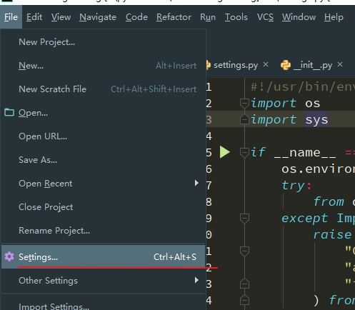
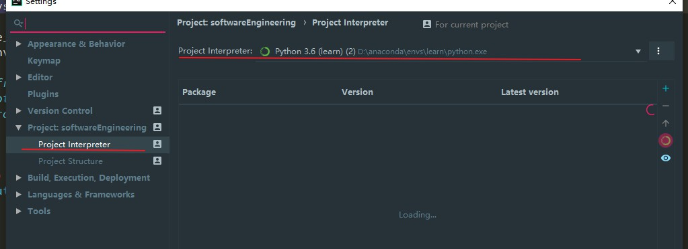

选择你的python解析器路径，图中是我已经配置好的，然后在根据下图操作

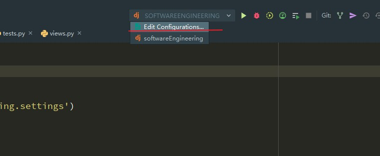
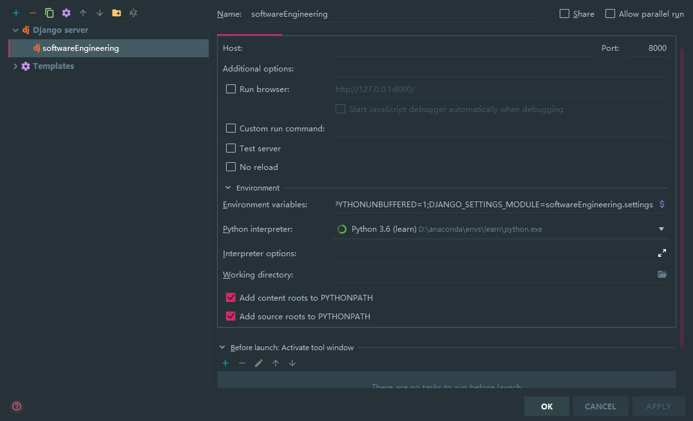

一样按图配置即可

### 项目运行
在你的mysql中新建一个数据库，将项目文件夹里面的sql文件导入你的新建数据库中，然后进入setting.py文件中
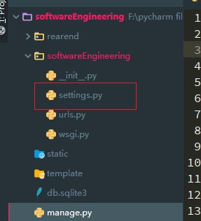
然后找到这一段
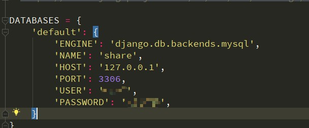
修改你的数据库名称账号密码

使用pycharm的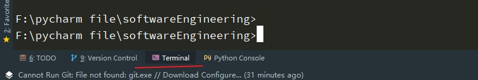terminal进行操作，其实就是cmd，如果用cmd操作的话请进入到项目文件夹下，输入命令`python manage.py inspectdb`映射出新的model关系
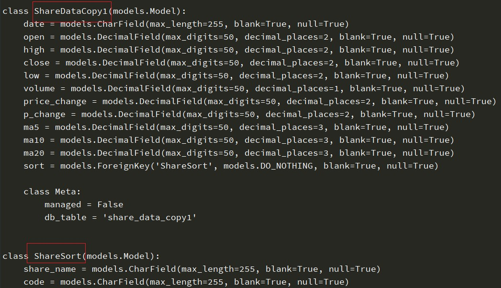
然后复制生成的代码，注意这里class名就是你的表名，里面变量就是各个列名，复制生成的代码粘贴到下面文件中
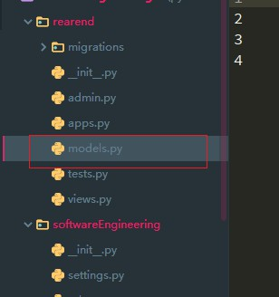
注意不要把头文件引入的代码给覆盖了
最后点击运行键运行即可
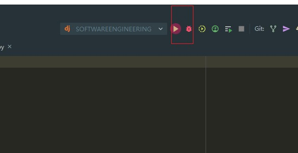
使用浏览器进入下面的网址即可
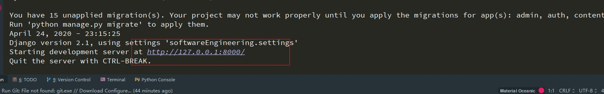

